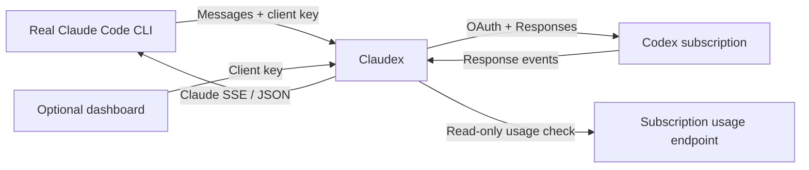

# How Claudex works

Claudex translates Claude Code's Messages API traffic for a single Codex
subscription account. It has no provider plugins, model downloads, generic OpenAI
endpoints, remote management, or account load balancing.

## Request lifecycle

1. The launcher starts the macOS service, loads generated Claude settings, and
   injects the client key. Claude Code never receives the Codex sign-in token.
2. Claudex authenticates the request and bounds its body. It resolves the requested
   model and translates Claude system prompts, messages, and tools to Codex
   Responses input.
3. The credential store rereads the Codex sign-in file and refreshes credentials
   shortly before they expire. It writes refreshed tokens atomically. A
   cross-process file lock stops cooperating Claudex instances from racing the same
   refresh token. A transient refresh failure does not fail the request while the
   current access token is still valid.
4. The fixed Codex transport sends the request to the subscription Responses
   endpoint. After a 401, the gateway refreshes the sign-in once and retries. It
   does not retry when the refreshed sign-in belongs to a different account.
   For streamed responses, the local input token estimate runs in parallel with
   this request, so it adds no delay before the first byte.
5. The translator returns Claude-compatible JSON or streaming events. It preserves
   tool IDs, errors, refusals, images, parallel calls, URL citations, and encrypted
   reasoning state for later turns. Codex search activity is left out of history.
   Anthropic accepts search-result replay only with opaque state that Anthropic
   issued. A terminal failure never becomes an empty successful turn.
6. With `-dashboard`, the gateway records request metadata and token usage. See
   [the dashboard notes](dashboard.md) for what is kept.

## HTTP routes

These routes require the client key. Send it as `Authorization: Bearer <key>` or
as `X-Api-Key`. The `Bearer` scheme matches in any letter case. Each header is
checked on its own.

| Route | Purpose |
| --- | --- |
| `POST /v1/messages` | Messages, streamed or not |
| `POST /v1/messages/count_tokens` | Local token estimate |
| `GET /v1/models` | Model list |
| `GET /v1/models/{id}` | One model |
| `GET /dashboard/api` | Dashboard metrics, only with `-dashboard` |

These routes need no key:

| Route | Purpose |
| --- | --- |
| `GET /healthz` | Liveness probe for Docker, launchd, and `claudex status` |
| `HEAD /api/hello` | Connectivity probe for Claude Code |
| `GET /dashboard` and its embedded assets | Dashboard login page, only with `-dashboard` |

`GET /healthz` returns JSON with `product`, `status`, `version`, and the default
`model`. `product` is always `claudex`. Without `-dashboard`, no dashboard routes
exist.

## Reasoning and tools

Claudex picks one GPT effort per request. It applies these rules in order:

| Claude request | Effort sent to GPT |
| --- | --- |
| `thinking.type: disabled` | `none`. Astra has no `none`, so it gets `low`. |
| Explicit `output_config.effort` | That effort, after the rewrites below |
| `thinking.type: enabled` with `budget_tokens: -1` | Configured default |
| `budget_tokens: 0` | `none` |
| `budget_tokens` up to 1024 | `low` |
| `budget_tokens` up to 8192 | `medium` |
| `budget_tokens` up to 24576 | `high` |
| Larger `budget_tokens` | `xhigh` |
| No effort and no budget | Configured default |

Claudex then rewrites a few values:

| Effort | Becomes |
| --- | --- |
| `auto` or empty | Configured default |
| `ultra`, `ultracode` | `xhigh` |
| `minimal` | `low` |
| `max` | `max` |

An effort the model does not support returns an error. A `budget_tokens` value
that is not an integer of at least -1 also returns an error. The Codex API accepts
only `none`, `minimal`, `low`, `medium`, `high`, `xhigh`, and `max`. It rejects
`ultra`.

Codex's own Ultra setting is a client mode, not an API level. A captured Codex CLI
request at Ultra carries `xhigh` and turns on proactive multi-agent delegation. Max
carries `max`. Under Claudex, Claude Code's ultracode workflow supplies the
delegation. The gateway does not implement Codex's multi-agent harness.

Astra's `low` fallback for disabled thinking cannot promise zero reasoning.
`thinking.display: omitted` hides visible summaries but keeps encrypted reasoning
for replay. Disabled thinking also hides visible summaries.

Claude's WebSearch function and typed web-search declarations become Codex native
`web_search`. The search-grounded answer returns as text, and URL annotations
return as Markdown links. Claudex does not synthesize Anthropic `server_tool_use`
or `web_search_tool_result` blocks. Those blocks cannot be resumed without
`encrypted_content` issued by Anthropic. WebFetch and ordinary local tools still run
in Claude Code. Artifact publishing is blocked because no subscription bridge for
it exists. Creating ordinary files still works.

## Quota recovery

A subscription `usage_limit_reached` response records an in-memory cooldown. While
the cooldown lasts, a background worker checks a read-only usage endpoint once a
minute. The cooldown clears only when every returned inference pool explicitly
allows requests. Missing fields, failed probes, and stale results cannot clear a
newer failure. Short-term rate errors do not create a credential-wide cooldown.

This repairs stale local cooldowns without spending inference quota. It cannot
bypass an exhausted subscription, and it offers no account or model failover.

## Code layout

| Package | Responsibility |
| --- | --- |
| `cmd/claudex` | Flags, initialization, lifecycle, sign-in, graceful shutdown |
| `internal/config` | Strict config validation, model catalog, family aliases |
| `internal/auth` | OAuth PKCE, credential store, refresh and atomic persistence |
| `internal/codex` | Fixed upstream HTTP transport and read-only usage checks |
| `internal/proxy` | Claude HTTP surface, request policy, streaming lifecycle |
| `internal/translator/codex/claude` | Claude and Responses protocol conversion |
| `internal/quota` | Cooldown evidence, generation checks, recovery |
| `internal/tokens` | Approximate local token counting |
| `internal/dashboard` | Bounded usage history and local dashboard |
| `internal/launcher` | The `install`, `service`, `launch`, and `status` commands: macOS service management, the Claude Code launcher, and setup checks |
| `internal/signature`, `internal/translator/common` | Reasoning-signature checks and shared Claude message helpers |
